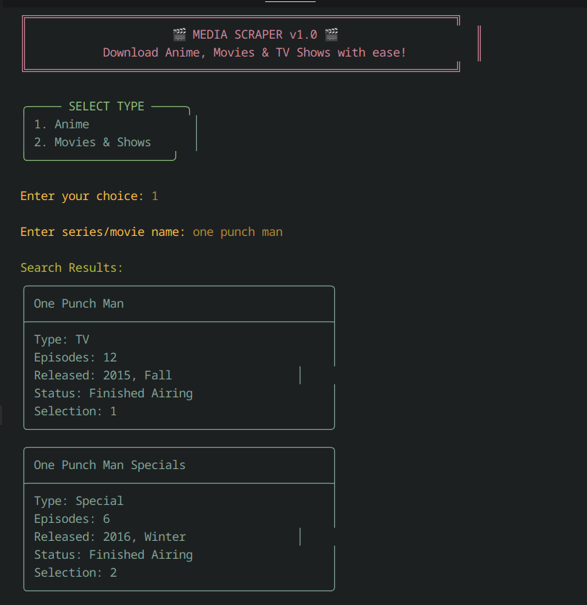
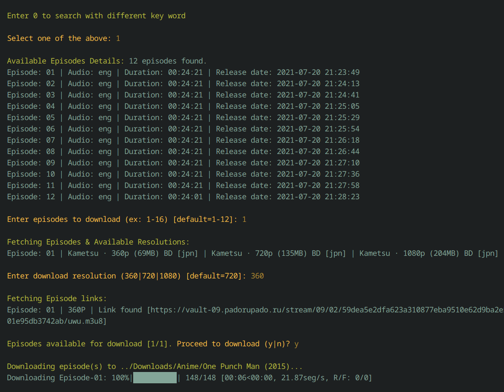

# Media Scraper

A command-line tool for downloading Anime, Movies & TV Shows with ease. This scraper supports downloading content from multiple sources with features like batch downloading, resolution selection, and more.

## Screenshots

Here's how the scraper looks in action:




## Features

- Multi-source support for Anime and Movies/TV Shows
- Batch downloading with parallel download support
- Resolution selection (360p to 1080p)
- Season and episode range selection
- HLS/M3U8 stream downloading
- Progress tracking with status display
- Colorized output (can be disabled)
- Detailed logging
- Cross-platform support (Windows/Linux path handling)
- Command-line interface with extensive options

## Requirements

- Python 3.x
- Required packages:
  - argparse
  - pyyaml
  - beautifulsoup4
  - requests
  - tqdm
  - pycryptodomex
  - undetected-chromedriver
  - setuptools
  - quickjs

## Installation

1. Clone this repository:
```bash
git clone https://github.com/yourusername/scraper.git
cd scraper
```

2. Install required packages:
```bash
pip install -r requirements.txt
```

## Usage

Basic usage:
```bash
python scraper.py
```

The tool will guide you through:
1. Selecting content type (Anime/Movies & Shows)
2. Searching for your desired series/movie
3. Selecting seasons/episodes
4. Choosing resolution
5. Starting the download process

### Command Line Arguments

```bash
python scraper.py [-h] [-c CONF] [-l LOG_FILE] [-s SERIES_TYPE] [-n SERIES_NAME]
                  [-S SEASONS] [-e EPISODES] [-r RESOLUTION] [-d] [-dc]
                  [-hsa [0-100]] [-dl]

Options:
  -h, --help            Show this help message
  -c, --conf           Configuration file (default: config_scraper.yaml)
  -l, --log-file       Custom log file name
  -s, --series-type    Type of series
  -n, --series-name    Name of the series to search
  -S, --seasons        Seasons to download (for TV Shows)
  -e, --episodes       Episodes to download
  -r, --resolution     Resolution to download
  -d, --start-download Start download immediately
  -dc, --disable-colors Disable colored output
  -hsa, --hls-size-accuracy Accuracy for HLS file size display [0-100]
  -dl, --disable-looping Disable auto-restart
```

### Examples

1. Basic interactive usage:
```bash
python scraper.py
```

2. Download specific anime episodes:
```bash
python scraper.py -s 1 -n "One Piece" -e "1-10" -r 720 -d
```

3. Download TV show season:
```bash
python scraper.py -s 2 -n "Breaking Bad" -S "1" -e "1-5" -r 1080 -d
```

## Configuration

The tool uses a YAML configuration file (default: `config_scraper.yaml`) with the following sections:

- DownloaderConfig: Download settings (paths, threads, etc.)
- LoggerConfig: Logging settings
- Anime: Anime-specific settings
- Movies & Shows: Movie/TV show specific settings

### Changing Download Directory

You can change the download directory in two ways:

1. In the configuration file (`config_scraper.yaml`):
```yaml
DownloaderConfig:
  download_dir: "~/Downloads/Media"  # Change this path
  max_parallel_downloads: 3

# You can also set different directories for different content types:
Anime:
  download_dir: "~/Downloads/Anime"  # Specific path for anime

Movies & Shows:
  download_dir: "~/Downloads/Shows"  # Specific path for shows/movies
```

2. Through environment variables:
   - Set the `DOWNLOAD_DIR` environment variable before running the script
   - Content-specific paths take precedence over the general download directory

Note: The download paths support both Windows and Linux style paths. The script will automatically handle path conversion based on your operating system.

Example configuration:
```yaml
DownloaderConfig:
  download_dir: "~/Downloads/Media"
  max_parallel_downloads: 3

LoggerConfig:
  log_dir: "logs"
  log_level: "INFO"
  log_retention_days: 7
  log_backup_count: 3
```

## License

This project is licensed under the terms specified in `LICENSE.md`.

## Contributing

Feel free to submit issues, fork the repository, and create pull requests for any improvements.